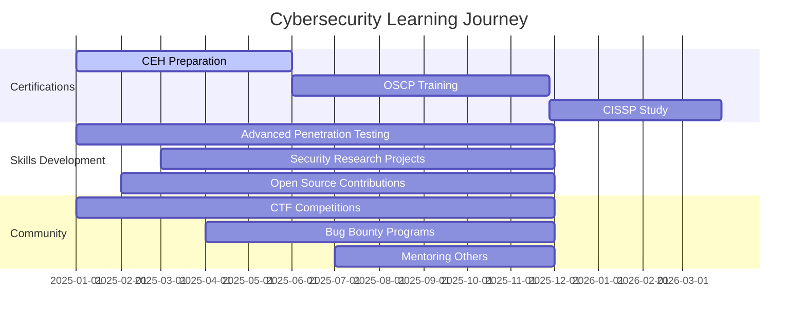

# 🛡️ Namaste, I'm Anurag Revankar 🔐

<div align="center">
  
  
  
  [](https://github.com/anurag-rvnkr1)

</div>

---

## 🌐 Connect With Me

<div align="center">
  
[](https://github.com/anurag-rvnkr1)
[](https://www.linkedin.com/in/anu-rvnkr-m416g)
[](https://www.instagram.com/anurag_rvnkr)

</div>

---

## 👨‍💻 About Me


```yaml
name: "Anurag Revankar"
role: "Cybersecurity Enthusiast & Ethical Hacker"
location: "India 🇮🇳"
education: "Student"
focus: ["Ethical Hacking", "Penetration Testing", "Security Research"]
status: "Always Learning & Building"
goal: "Creating Secure Digital Solutions"
```

I'm a passionate **cybersecurity enthusiast** with a deep fascination for ethical hacking and digital security. As a student driven by curiosity and innovation, I'm actively seeking opportunities to apply my skills in real-world scenarios. My journey is defined by continuous learning, hands-on experimentation, and a commitment to building secure digital environments.

**What drives me:**
- 🔍 Discovering vulnerabilities and strengthening defenses
- 🛠️ Building tools that enhance cybersecurity
- 📚 Staying updated with the latest security trends
- 🤝 Collaborating with the cybersecurity community
- 🎯 Contributing to open-source security projects

---

## 🏆 Featured Projects

<div align="center">

[](https://github.com/anurag-rvnkr1/Secure-Vault)

</div>

<div align="center">
  
[](https://github.com/anurag-rvnkr1?tab=repositories)

</div>

---

## 🛠️ Technical Arsenal

### 💻 Programming Languages
<div align="center">


</div>

### 🔐 Security Tools & Frameworks
<div align="center">


</div>

### 🖥️ Operating Systems
<div align="center">


</div>

---

## 📊 GitHub Analytics

<div align="center">
  
  
  
  

</div>

<div align="center">
  
  

</div>

---

## 🎯 Roadmap & Goals



### 🏅 Current Objectives
- 🎓 **Advanced Certifications**: CEH, OSCP, CISSP
- 🔬 **Security Research**: Contributing to vulnerability research
- 🏆 **CTF & Bug Bounties**: Active participation in competitions
- 🛡️ **Tool Development**: Creating innovative security solutions
- 👥 **Community Impact**: Mentoring and knowledge sharing

---

## 💡 Latest Activity

```python
class AnuragRevankar:
    def __init__(self):
        self.name = "Anurag Revankar"
        self.role = "Cybersecurity Enthusiast"
        self.language_spoken = ["en_US", "hi_IN"]
        self.currently_learning = ["Advanced Penetration Testing", "Malware Analysis"]
        self.current_focus = "Building Secure-Vault and security tools"
        
    def say_hi(self):
        print("Thanks for visiting my profile! Let's connect and build secure solutions together!")

me = AnuragRevankar()
me.say_hi()
```

---

## 🤝 Let's Collaborate!

<div align="center">

**"The best defense is a good offense - but an ethical one."**

I'm always excited to:
- 🤝 Collaborate on cybersecurity projects
- 💬 Discuss emerging security threats
- 📚 Share knowledge and learn from others
- 🎯 Work on innovative security solutions

</div>

---

<div align="center">
  
  
  
  [](https://github.com/anurag-rvnkr1)
  
  **Made with 💙 and ⚡ by Anurag Revankar**

</div>
