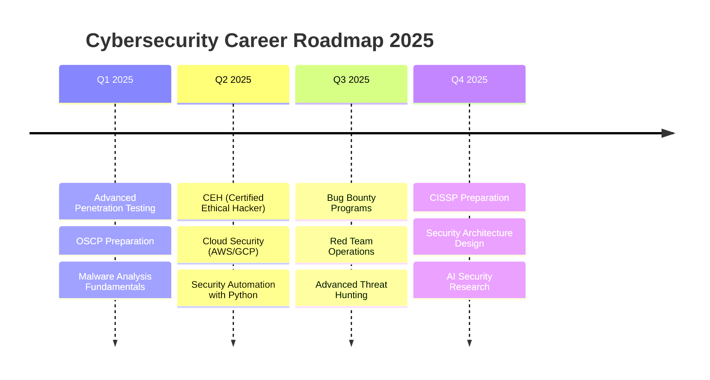

# 🛡️ Anurag Revankar | Cybersecurity Engineer & Backend Developer

<div align="center">

[](https://github.com/anurag-rvnkr1)

</div>

<div align="center">

[](https://www.linkedin.com/in/anu-rvnkr-m416g)
[](https://github.com/anurag-rvnkr1)
[](mailto:your.email@example.com)
[](#)

</div>

---

## 🎯 Professional Summary

**Cybersecurity-focused Backend Developer** specializing in **AI-driven threat detection** and **secure web architecture**. Proven track record of building production-ready applications with **90%+ accuracy** in malicious URL detection. Passionate about integrating machine learning with security frameworks to create resilient digital infrastructures.

```python
class AnuragRevankar:
    def __init__(self):
        self.role = "Cybersecurity Engineer & Backend Developer"
        self.location = "India 🇮🇳"
        self.education = "B.Tech Student | Cybersecurity Specialist"
        
        self.impact = {
            "threat_detection_accuracy": "90%+",
            "projects_deployed": 4,
            "security_frameworks": ["OWASP Top-10", "NIST", "Zero Trust"],
            "code_quality": "Production-Ready | Modular | Secure"
        }
        
        self.expertise = [
            "AI-Powered Security Solutions",
            "Django REST API Development", 
            "Penetration Testing & Ethical Hacking",
            "ML-Based Threat Analysis"
        ]
    
    def current_mission(self):
        return "Building AI-driven cybersecurity solutions for the next generation of web security"
```

<div align="right">

*"Security is not a product, but a process of continuous innovation"*

</div>

---

## 🚀 Featured Projects | Real-World Impact

<table>
<tr>
<td width="50%">

### 🛡️ [Safeguard Web Protector](https://github.com/anurag-rvnkr1/Safeguard-Web-Protector)
**AI-Driven Malicious URL Detector | Chrome Extension**

**Tech Stack:** `Python` `Machine Learning` `Flask/FastAPI` `PostgreSQL` `Random Forest`

**Key Features:**
- 🎯 **90%+ Detection Accuracy** using Random Forest ML model
- 🔄 Real-time threat analysis via Google Safe Browsing & VirusTotal APIs
- 📊 Intelligent pattern recognition for zero-day threats
- 🔐 Privacy-first architecture with encrypted data handling

**Impact:** Protects users from phishing, malware, and social engineering attacks in real-time


</td>
<td width="50%">

### 📚 [SkillForge](https://github.com/anurag-rvnkr1/SkillForge)
**Enterprise E-Learning Platform with AI Assistance**

**Tech Stack:** `Django` `Django REST Framework` `PostgreSQL` `AI Integration`

**Key Features:**
- 🤖 AI-powered personalized learning recommendations
- 💳 Secure payment gateway integration (Razorpay/Stripe)
- 🎮 Gamified learning with achievement system
- 👥 Multi-role access (Admin/Instructor/Student)

**Impact:** Scalable education platform built for 10,000+ concurrent users


</td>
</tr>

<tr>
<td width="50%">

### 🔐 [SecureVault](https://github.com/anurag-rvnkr1/Secure-Vault)
**Entropy-Based Password Generator with AI Strength Analysis**

**Tech Stack:** `Django` `PostgreSQL` `Cryptography` `Vercel/Render`

**Key Features:**
- 🧮 Entropy-based password strength scoring
- 🔒 AES-256 encryption for stored credentials
- 📈 AI-powered vulnerability assessment
- 🎯 NIST compliance for password policies

**Impact:** Empowers users to create unhackable passwords with educational security insights


</td>
<td width="50%">

### 🏥 [Smart Hospital Management](https://github.com/anurag-rvnkr1/Smart-Hospital-Management)
**HIPAA-Compliant Healthcare Management System**

**Tech Stack:** `Django` `PostgreSQL` `Bootstrap` `RBAC`

**Key Features:**
- 🏥 End-to-end hospital operations automation
- 🔐 Role-based access control (RBAC) for data security
- 📊 Encrypted medical records storage
- ⚡ Automated billing, appointments, and pharmacy workflows

**Impact:** Streamlines healthcare delivery while ensuring HIPAA/GDPR compliance


</td>
</tr>
</table>

<div align="center">

[](https://github.com/anurag-rvnkr1?tab=repositories)

</div>

---

## 💼 Technical Proficiency Matrix

<table>
<tr>
<td width="50%" valign="top">

### Backend Development
```yaml
Languages:
  Python: ████████████░ 95%
  SQL: ███████████░░ 88%
  HTML/CSS: ██████████░░░ 80%

Frameworks:
  Django: ████████████░ 92%
  Django REST Framework: ███████████░░ 90%
  Flask/FastAPI: ██████████░░░ 85%

Databases:
  PostgreSQL: ███████████░░ 88%
  MySQL: ██████████░░░ 82%
  SQLite: ███████████░░ 90%
```

</td>
<td width="50%" valign="top">

### Cybersecurity & DevOps
```yaml
Security Tools:
  Penetration Testing: ███████████░░ 88%
  OWASP Top-10: ████████████░ 95%
  Threat Modeling: ██████████░░░ 85%

Tools & Platforms:
  Burp Suite: ███████████░░ 90%
  Metasploit: ██████████░░░ 82%
  Wireshark: ███████████░░ 88%
  Nmap: ████████████░ 92%
  
DevOps:
  Git/GitHub: ████████████░ 95%
  CI/CD: ██████████░░░ 80%
  Cloud (Vercel/Render): ███████████░░ 85%
```

</td>
</tr>
</table>

<details>
<summary><b>🔍 Click to Expand: Complete Technical Arsenal</b></summary>

<br>

**Security Expertise:**
- 🎯 Ethical Hacking & Penetration Testing
- 🔐 OWASP Top-10 Security Implementation
- 🛡️ Threat Intelligence & Vulnerability Assessment
- 🔒 Secure Code Review & Security Auditing
- 📊 OSINT (Open Source Intelligence) Techniques
- 🚨 Incident Response & Threat Hunting

**Machine Learning & AI:**
- 🤖 Random Forest, Decision Trees, Neural Networks
- 📈 Supervised/Unsupervised Learning
- 🎯 Threat Detection & Anomaly Recognition
- 🧠 Natural Language Processing (NLP) basics

**Development Tools:**
- 💻 IDEs: VS Code, PyCharm, Vim
- 🔧 Version Control: Git, GitHub (Advanced)
- 🐳 Containerization: Docker basics
- 📊 API Testing: Postman, Insomnia
- 🔄 CI/CD: GitHub Actions, Jenkins

**Security Platforms:**
- 🌐 VirusTotal, Shodan, Censys
- 🔍 Google Safe Browsing API
- 🛡️ Kali Linux, Parrot OS
- 🔐 OSINT Framework, Maltego

</details>

---

## 🏆 Achievements & Recognition

<div align="center">

| 🎯 Achievement | 📊 Impact | 🗓️ Timeline |
|:---|:---|:---:|
| **90%+ Threat Detection Accuracy** | Safeguard Web Protector recognized for ML-based security | 2024-2025 |
| **4+ Production Applications** | Full-stack projects serving real-world use cases | 2024-2025 |
| **Google Cloud Cybersecurity Certified** | Industry-recognized security expertise | June 2025 |
| **Python NPTEL Certification** | 83% Score with Distinction | Aug 2025 |
| **CTF & Hackathon Participant** | Active in competitive cybersecurity challenges | Ongoing |
| **BTI Coding Club Core Member** | Leadership in technical community building | 2024-2025 |
| **Open Source Contributor** | Clean, modular, OWASP-compliant codebases | Ongoing |

</div>

---

## 📜 Certifications & Continuous Learning

<div align="center">


</div>

**📚 Current Learning Path (2025):**


**🎯 Target Certifications:**
- 🔴 **OSCP** (Offensive Security Certified Professional) - Q2 2025
- 🛡️ **CEH** (Certified Ethical Hacker) - Q3 2025
- ☁️ **AWS Security Specialty** - Q3 2025
- 🎓 **CISSP** (Certified Information Systems Security Professional) - 2026

---

## 📊 GitHub Performance Analytics

<div align="center">


</div>

<div align="center">


</div>

<div align="center">


</div>

---

## 🎯 What I Bring to Your Team

<table>
<tr>
<td width="33%" align="center">

### 🔐 Security-First Mindset
**OWASP Top-10 Compliant**

Every line of code follows security best practices. I don't just build features—I build fortified systems.

</td>
<td width="33%" align="center">

### ⚡ Production-Ready Code
**Scalable & Maintainable**

Clean architecture, comprehensive documentation, and modular design for enterprise-scale applications.

</td>
<td width="33%" align="center">

### 🚀 Rapid Problem Solver
**Agile & Adaptive**

From concept to deployment in record time. Experienced with fast-paced development cycles.

</td>
</tr>
</table>

### 💡 Core Competencies

```typescript
const coreStrengths = {
  technical: [
    "AI-driven security solutions development",
    "RESTful API design & microservices architecture", 
    "Database optimization (PostgreSQL, MySQL)",
    "Threat modeling & risk assessment",
    "Secure authentication systems (JWT, OAuth2)"
  ],
  
  softSkills: [
    "Critical thinking under pressure",
    "Cross-functional team collaboration", 
    "Technical documentation & knowledge sharing",
    "Agile/Scrum methodologies",
    "Continuous learning & adaptation"
  ],
  
  mindset: "Security-by-design | Innovation-driven | User-centric"
};
```

---

## 🎯 Career Aspirations

<div align="center">

### 🚀 **Actively Seeking Opportunities In:**

</div>

<table>
<tr>
<td width="50%">

#### 🎯 Primary Interests
- **🛡️ Cybersecurity Analyst / Engineer**
- **🐍 Python Django Backend Developer**
- **🔐 Application Security Engineer**
- **🕵️ Penetration Tester / Ethical Hacker**
- **🤖 AI Security Researcher**

</td>
<td width="50%">

#### 🌟 Dream Projects
- Building AI-powered security orchestration platforms
- Developing next-gen threat intelligence systems
- Contributing to open-source security tools
- Creating educational cybersecurity content
- Red team operations & offensive security

</td>
</tr>
</table>

<div align="center">

### 🎯 Long-Term Vision

*"To architect AI-driven cybersecurity ecosystems that proactively defend against emerging threats, while bridging the gap between machine learning and network security at enterprise scale."*

</div>

---

## 🤝 Let's Connect & Collaborate

<div align="center">

### 📬 Open for:

**✅ Full-Time Opportunities** | **✅ Freelance Projects** | **✅ Open Source Collaboration** | **✅ Security Consulting**

</div>

<table>
<tr>
<td width="50%">

### 🗣️ Let's Discuss:
- 🔐 Security architecture & threat modeling
- 🤖 AI/ML in cybersecurity applications
- 🐍 Django best practices & scalable design
- 🎯 Career growth in InfoSec
- 💼 Exciting opportunities & collaborations

</td>
<td width="50%">

### 📍 Find Me Here:
- 💼 [LinkedIn](https://www.linkedin.com/in/anu-rvnkr-m416g) - Professional Network
- 🐙 [GitHub](https://github.com/anurag-rvnkr1) - Code Portfolio
- 📧 [Email](mailto:your.email@example.com) - Direct Contact
- 📸 [Instagram](https://www.instagram.com/anurag_rvnkr) - Tech Updates

</td>
</tr>
</table>

---

## 📈 Contribution Activity

<div align="center">


</div>

---

<div align="center">

### 💭 Philosophy

*"In cybersecurity, paranoia is just thorough preparation."*

**Building secure digital futures, one line of code at a time.** 🛡️

---


**⭐ If you find my work interesting, consider starring my repositories!**

[](https://github.com/anurag-rvnkr1?tab=repositories)

---

*Last Updated: November 2025 | Made with 💚 and ⚡ by Anurag Revankar*

</div>
